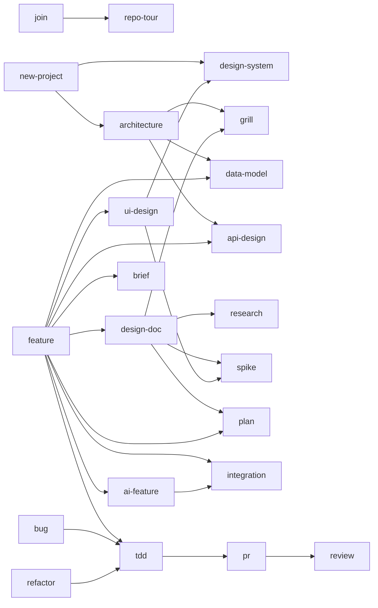
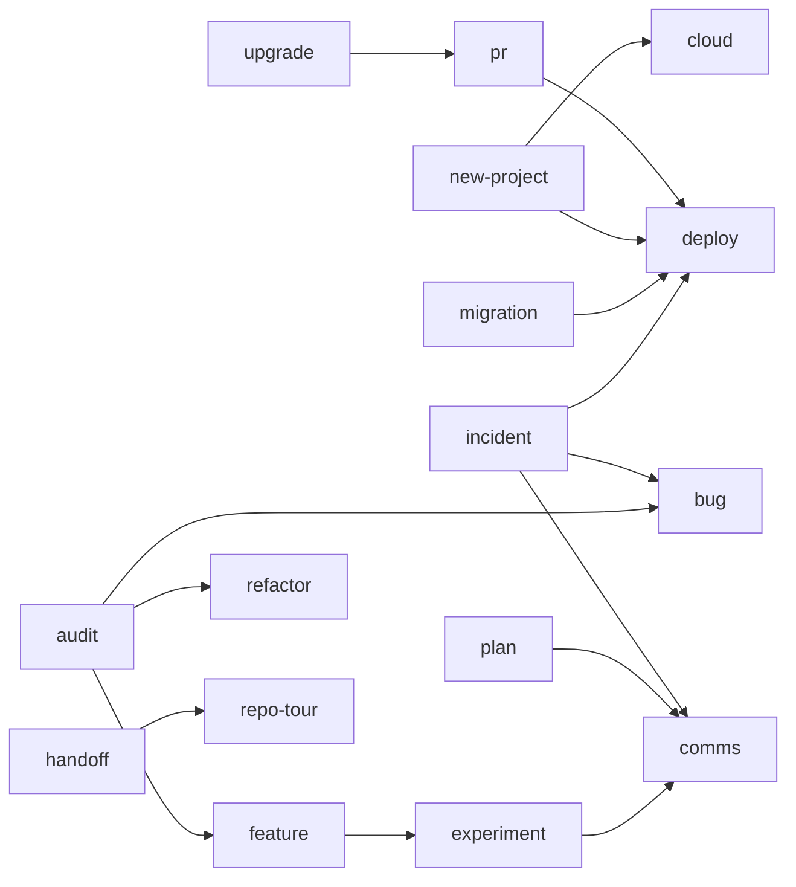

# The ecosystem

How the pieces fit together: the lessons, the pages, the skills, and the files they leave behind in a project.
How I checked that nothing is missing: [COVERAGE.md](COVERAGE.md).

## Five layers

| Layer | What it is | Where it lives |
|---|---|---|
| Lessons | why and how a concept works | your own learning material, linked to the pages by the lessons file in your personal settings (mine: my Frontend, Backend, C# and System Design tracks) |
| Pages | how I work, one page per situation; the only place where the process is written | this repo |
| Skills | run a page step by step and stop where I decide; how they behave is in `SKILLS.md` | `skills/` in this repo, linked into `~/.claude/skills/` by `install.sh` |
| Project files | what the skills leave behind in each project | the project repo (`docs/`, `CLAUDE.md`, ...) |
| Growth loop | after every task, week and quarter, the pages, `CLAUDE.md` and my impact log get better | `/wow-retro` |

## The work, from start to finish

```mermaid
flowchart TD
  WOW["wow: what is in front of me?"]
  WOW --> ST
  subgraph ST[Start]
    NP[new-project]
    JO[join]
    RT[repo-tour]
  end
  subgraph DC[Decide]
    GR[grill]
    RE[research]
    SP[spike]
  end
  subgraph DS[Design]
    AR[architecture]
    DM[data-model]
    AP[api-design]
    UI[ui-design]
    DSY[design-system]
    IN[integration]
    AI[ai-feature]
    DD[design-doc]
  end
  subgraph PL[Plan]
    PN[plan]
  end
  subgraph BD[Build]
    FE[feature]
    BU[bug]
    RF[refactor]
    TD[tdd]
    BR[brief]
    RV[review]
    PR[pr]
  end
  subgraph SH[Ship]
    DE[deploy]
    CL[cloud]
    MI[migration]
    UP[upgrade]
    EX[experiment]
  end
  subgraph RN[Run]
    INC[incident]
    AU[audit]
  end
  subgraph PE[People]
    CO[comms]
    ME[mentor]
    HO[handoff]
  end
  ST --> DC --> DS --> PL --> BD --> SH --> RN
  RN --> PE
```

`explain-again` and `retro` work everywhere, so they are not in the picture.

## Which skill hands off to which

Design and build:

Ship and run:

- **Feature, by size:**
  - Medium and large features go through `plan`, `ui-design`, `api-design` and `data-model`.
  - Large features also go through `design-doc`.
  - In a small feature these steps are a few lines in the ticket.
- **`incident`:** `deploy` rolls back first, `comms` tells people what is happening, and `bug` makes the real fix.
- **`audit`:** every finding I decide to fix becomes a `feature`, a `bug` or a `refactor`.
- **`tdd`:** the coding loop inside `feature`, `bug` and `refactor`.
- **Every skill:**
  - calls `explain-again` when I'm stuck on a concept;
  - writes to `docs/risks.md` when it finds a risk;
  - writes to `docs/tech-debt.md` when we accept a shortcut;
  - ends with `retro`.

## Files the skills share

In the project:

| File | What it holds | Written by | Read by |
|---|---|---|---|
| `CLAUDE.md` | rules for AI in this project | new-project, join, retro | every skill, especially brief |
| `REPO-MAP.md` | how the code is laid out, with one request traced end to end | repo-tour, handoff | join, brief, review |
| `GLOSSARY.md` | the project's words, one line each | grill, data-model, repo-tour | every skill, explain-again |
| `docs/adr/` | one decision per file: context, choice, options not chosen | grill, architecture, design-doc, new-project | join, review, handoff |
| `docs/design/` | design docs | design-doc | feature, plan, review |
| `docs/definition-of-done.md` | when a ticket is ready to start, and when it is done | new-project | feature, pr, review |
| the ticket | problem, number, acceptance criteria, estimate | feature, plan | brief, review, pr, retro |
| `docs/tracking-plan.md` | the events the app sends, their fields, who owns them | feature, experiment, ai-feature | audit (analytics, privacy) |
| `docs/experiments/` | one file per experiment: hypothesis, metric, guardrails, result | experiment | feature, comms |
| `docs/risks.md` | open risks, with owner and what we do about each | plan, design-doc, grill, architecture | comms, handoff |
| `docs/tech-debt.md` | shortcuts we took, what they cost, when to pay them back | review, audit, refactor | plan, refactor, handoff |
| `docs/runbook.md` | how to restart, roll back, restore, and where the logs are | new-project, cloud, deploy | incident, handoff |
| `docs/postmortems/` | one file per incident | incident | audit, handoff |
| `docs/audits/` | one report per audit, with numbers before and after | audit | handoff |
| `HANDOFF.md` | state, risks, access, who knows what | handoff | join (the next person) |

Mine, outside any project:

| File | What it holds | Written by | Read by |
|---|---|---|---|
| `ways-of-working/` | the pages | retro | every skill |
| `~/.claude/wow-config.md` | personal settings: name, chat language, background, where the impact log, career tracker and lessons file are | `install.sh` (from `config.example.md`), then me | every skill |
| `impact-log.md` (private) | what I did and what changed, with numbers | retro (task) | retro (quarter): CV, STAR stories, career tracker evidence |

## Which one, when two look alike

| If... | Use | Not |
|---|---|---|
| users are affected right now | incident | bug |
| something is wrong, but nobody is blocked | bug | incident |
| one thing got slow | bug (the hard-bug path) | audit |
| you want to check a whole area, not one problem | audit | bug |
| you choose between options by asking questions | grill | design-doc |
| the decision is big and others must review it | design-doc (it runs grill inside) | grill alone |
| the docs can answer the question | research | spike |
| only building something will answer it | spike | research |
| you design the whole system or a big part of it | architecture | data-model, api-design |
| you design the tables of one feature | data-model | architecture |
| you design an API that you provide | api-design | integration |
| you call a service you don't own | integration | api-design |
| that service is an LLM | ai-feature (it runs integration inside) | integration alone |
| the product uses AI | ai-feature | brief |
| you use AI to write code | brief | ai-feature |
| you design a screen or a flow | ui-design | design-system |
| you build a component or tokens that many screens reuse | design-system | ui-design |
| you decide how to build it | design-doc | plan |
| you decide when, in which order, and how long | plan | design-doc |
| the behavior changes | feature | refactor |
| the behavior stays the same and the code changes | refactor | feature |
| you write the code yourself, test by test | tdd | brief |
| you read someone else's code | review | pr |
| you open your own PR | pr (it runs review on your diff first) | review alone |
| you ship and watch for errors | feature (step 7) | experiment |
| you need proof that the change moved the number | experiment | feature alone |
| a package or framework version changes | upgrade | migration |
| your schema, data or API changes, or you move to a new library | migration | upgrade |
| you ship a release | deploy | cloud |
| servers, database, domain or secrets change | cloud | deploy |
| one item in front of you, or a list of incoming ones | wow | plan |
| you write a status, risk, decision or incident message | comms | design-doc |
| someone else needs to grow | mentor | explain-again |
| you arrive on a project | join (it runs repo-tour) | |
| you only need to understand a codebase | repo-tour | join |
| you leave a project | handoff | |

## Rules that keep it connected
1. **One place per thing.** The process lives only in the pages. A checklist lives in one page, and the others link to it: review links to the security list, it doesn't copy it.
2. **Same shape for every skill:**
   - when to use it, and when not (plus the skill to use instead);
   - what it reads;
   - the steps, with the STOPs;
   - what it writes;
   - which skill comes next;
   - retro at the end.
3. **A skill has no steps of its own.** It reads its page. When I change the page, the skill changes too.
4. **Every STOP is a question.** The skill asks it and waits.
5. **Nothing irreversible without me.** Skills never commit, push, deploy, delete data or spend money. They give me the command to run.
6. **No invented facts.**
   - A claim about the code points to a file and a line.
   - A claim about a tool points to its docs.
7. **Getting stuck and finishing.** Stuck on a concept → explain-again, which links the lesson. Every task ends with retro.
8. **English only:** pages, skills and project files.
9. **No streaks, no scores.** The growth loop records what changed, never how many days in a row.
10. **One prefix.** Every command is `/wow-<page>`, because `/bug`, `/review`, `/plan` and `/upgrade` are already Claude Code commands. In the diagrams and tables, the bare name is the page.

## Audit areas
Security, privacy, performance, accessibility, SEO, UX (with language and formats), analytics, testing, developer experience, production readiness (with failure modes and degraded states), cost, architecture.
One audit page holds the steps. Each area has one list.
