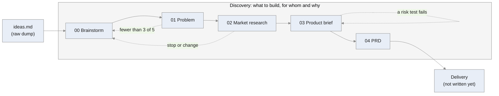

# Flows

Which skill to run, in what order, and what each one reads and writes. One flow per situation; a new flow is added when its skills exist.

## New product

From an idea, or no idea, to a decision and the requirements of the first version.



### Start
1. Write everything in your head into `docs/ideas.md`, in any form. No idea yet? Leave it empty.
2. Run `/discovery-brainstorm`.

### The steps

| # | Step | Command | Reads | Writes | Ends with |
|---|---|---|---|---|---|
| 00 | [Brainstorm](skills/discovery-brainstorm/SKILL.md) | `/discovery-brainstorm` | `ideas.md` (raw) | `00-brainstorm.md`, `ideas.md` (shaped) | one problem picked, two fallbacks |
| 01 | [Problem](skills/discovery-problem/SKILL.md) | `/discovery-problem` | `00-brainstorm.md`, `ideas.md` | `01-problem.md` | 3 of 5 interviews confirm it, or "not yet verified" |
| 02 | [Market research](skills/discovery-market-research/SKILL.md) | `/discovery-market-research` | `01-problem.md` | `02-market-research.md` | go, change or stop |
| 03 | [Product brief](skills/discovery-product-brief/SKILL.md) | `/discovery-product-brief` | `01`, `02`, `ideas.md` | `03-product-brief.md` | go, go with conditions, change or stop |
| 04 | [PRD](skills/discovery-prd/SKILL.md) | `/discovery-prd` | everything above | `04-prd.md`, `ideas.md` (sorted) | ready for delivery |

All files are in `docs/01-discovery/`, except `docs/ideas.md`.

### Going back
- **01 fails** (fewer than 3 of 5 describe the problem): change the person or the problem, or go back to 00 and take a fallback.
- **02 says stop or change:** back to 00 with what you learned.
- **A risk test from 03 fails,** even during 04 or later: back to 03, decide again, add a line to its journal.

### Status
00 Brainstorm hasn't been tried on a project yet. Everything else was done on MacroMate.

## Where the documents go

One folder per phase in the project's `docs/`, numbered in the order of the road; each step's file is numbered inside it:

```
docs/
  ideas.md               your raw ideas, shaped in 00 Brainstorm, sorted in 04 PRD
  01-discovery/
    00-brainstorm.md
    01-problem.md
    02-market-research.md
    03-product-brief.md
    04-prd.md
```
