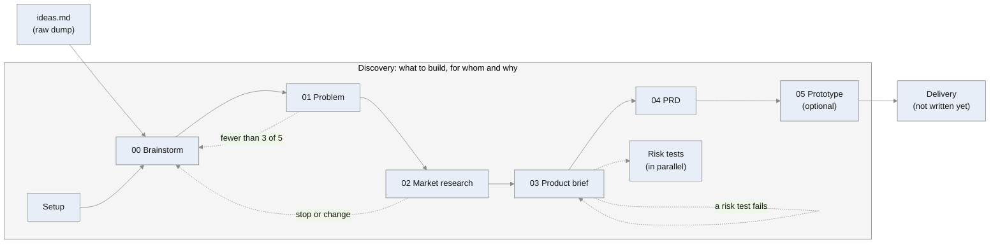

# Flows

Which skill to run, in what order, and what each one reads and writes. One flow per situation; a new flow is added when its skills exist.

## New product

From an idea, or no idea, to a decision and the requirements of the first version.



### Start
1. Run `/discovery-setup` once: it decides where the documents live and writes the `Project documents:` line in `CLAUDE.md`.
2. Write everything in your head into `docs/ideas.md`, in any form. No idea yet? Leave it empty.
3. Run `/discovery-brainstorm`.

### The steps

| # | Step | Command | Reads | Writes | Ends with |
|---|---|---|---|---|---|
| – | [Setup](skills/discovery-setup/SKILL.md) | `/discovery-setup` | the user's answers | `CLAUDE.md` line, `ideas.md` (empty), `01-discovery/` | the documents' place exists and the skills know it |
| 00 | [Brainstorm](skills/discovery-brainstorm/SKILL.md) | `/discovery-brainstorm` | `ideas.md` (raw) | `00-brainstorm.md`, `ideas.md` (shaped) | one problem picked, two fallbacks |
| 01 | [Problem](skills/discovery-problem/SKILL.md) | `/discovery-problem` | `00-brainstorm.md`, `ideas.md` | `01-problem.md` | 3 of 5 interviews confirm it, or "not yet verified" |
| 02 | [Market research](skills/discovery-market-research/SKILL.md) | `/discovery-market-research` | `01-problem.md` | `02-market-research.md` | go, change or stop |
| 03 | [Product brief](skills/discovery-product-brief/SKILL.md) | `/discovery-product-brief` | `01`, `02`, `ideas.md` | `03-product-brief.md` | go, go with conditions, change or stop |
| 04 | [PRD](skills/discovery-prd/SKILL.md) | `/discovery-prd` | everything above | `04-prd.md`, `ideas.md` (sorted) | ready for delivery |
| 05 | [Prototype](skills/discovery-prototype/SKILL.md) (optional) | `/discovery-prototype` | `04-prd.md`, `03-product-brief.md` | `05-prototype.md`, brief and PRD updated | pass, or fix and retest |
| – | [Risk tests](skills/discovery-risk-tests/SKILL.md) (in parallel, from 03) | `/discovery-risk-tests` | `03-product-brief.md` | `risk-tests.md`, brief updated | every risk in the brief has a result |

All files are in `docs/01-discovery/`, except `docs/ideas.md`. `docs/` is the documents folder from the `Project documents:` line in `CLAUDE.md`.

### Validate: a review of a document
**What it is:** every step from 01 on can also judge a document that already exists, without changing it: `/<skill> validate <file>`, for example `/discovery-prd validate docs/01-discovery/04-prd.md`. It's a code review for a document:
1. it reads the document and the ones it comes from (a PRD with its brief and problem);
2. it checks it item by item against what the step asks for, citing the lines;
3. it asks the questions no template asks (does every MVP feature trace back to the problem? do the numbers agree?);
4. it reports the problems from the most serious down, each with the line and what to change, then what the document does well. You pick what to apply.

**What it gives you:**
- you find what's missing without rewriting the document;
- a second pair of eyes when nobody else can read it;
- it catches gaps that change decisions, not only formatting (for example "22 features don't fit the time until launch");
- you can rerun it after every big change.

**When to run it:**
- **on a document written without the skill:** an older version, someone else's, one from your job;
- **before a decision that's hard to undo:** the end of 03 (go or stop) and of 04 (before architecture and code);
- **after a big change:** a test failed, the MVP was cut;
- **when nobody else can read it.**

Not right after writing with the skill (its "Done when" already checked it), and not for small edits.

## Where the documents go

`docs/` is wherever `/discovery-setup` put it: a private docs repo, `docs/` in the code repo, or the team's existing place. The `Project documents:` line in `CLAUDE.md` points to it. Inside, one folder per phase, numbered in the order of the road; each step's file is numbered inside it:

```
docs/
  ideas.md               your raw ideas, shaped in 00 Brainstorm, sorted in 04 PRD
  01-discovery/
    00-brainstorm.md
    01-problem.md
    02-market-research.md
    03-product-brief.md
    04-prd.md
    05-prototype.md
    risk-tests.md
```
