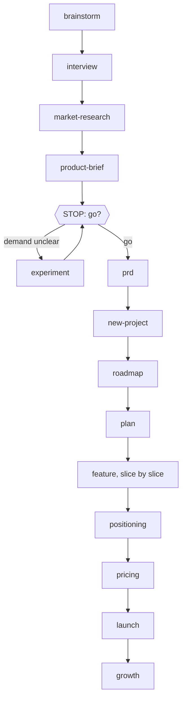
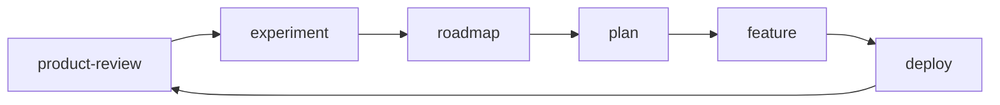

# Flows

The common journeys, from start to finish. Each line is a skill. You run one, and at its last STOP it offers the next. You can stop or skip anywhere; the page says what breaks if you do.

## 1. From an idea to the first paying users

1. `/wow-brainstorm`: the problem, the ideas, the riskiest assumption.
2. `/wow-interview`: five people. The idea is kept, changed, or dropped.
3. `/wow-market-research`: alternatives, prices, size.
4. `/wow-product-brief`: one page. Go, change, or drop.
5. `/wow-experiment`: a fake door or a pre-order, while demand is still the open question.
6. `/wow-prd`: journeys, requirements, the first version.
7. `/wow-new-project`: architecture, repo, CI, the first deploy. It runs `/wow-architecture`, `/wow-design-system`, `/wow-cloud` and `/wow-deploy`.
8. `/wow-roadmap`, then `/wow-plan`: the order of the work, and the slices.
9. `/wow-feature` for each slice. It runs `/wow-ui-design`, `/wow-api-design`, `/wow-data-model`, `/wow-tdd`, `/wow-pr` and `/wow-deploy`.
10. `/wow-positioning`, `/wow-pricing`, `/wow-launch`.
11. `/wow-growth` every week; add `/wow-sales` if you sell through conversations.

## 2. Improve a live product, every month

1. `/wow-product-review`: the outcome, the funnel, what users say, 1–3 picks.
2. `/wow-interview`: when the numbers show where users drop, but not why.
3. `/wow-experiment`: test the riskiest pick small.
4. `/wow-roadmap`: update Now, Next and Later.
5. `/wow-plan`, then `/wow-feature` for each Now item.

## 3. A feature
- **Small:** `/wow-feature` → `/wow-tdd` → `/wow-pr` → `/wow-deploy`.
- **Medium:** `/wow-feature` → `/wow-plan` → `/wow-ui-design`, `/wow-api-design`, `/wow-data-model` → `/wow-tdd` for each slice → `/wow-pr` → `/wow-deploy` → measure.
- **Large:** the medium flow, plus `/wow-grill` and `/wow-design-doc` before the design skills.
- **It calls a service you don't own:** add `/wow-integration`. **It calls an LLM:** add `/wow-ai-feature`.
- **You need proof it moved the number:** add `/wow-experiment`.

## 4. Something is broken
- **Users are affected now:** `/wow-incident`. It rolls back with `/wow-deploy` and sends updates with `/wow-comms`. Then `/wow-bug` for the fix and the postmortem. Run `/wow-audit production-readiness` if the cause was a gap.
- **Not urgent:** `/wow-bug` → `/wow-pr` → `/wow-deploy`.
- **A list of reports:** `/wow` sorts them, then each one goes to `/wow-bug` or `/wow-feature`.

## 5. A change to what exists
- **The shape of the code:** `/wow-refactor` → `/wow-pr`.
- **A schema, data, an API or a library:** `/wow-migration`, then `/wow-deploy` for each step.
- **A package version:** `/wow-upgrade` → `/wow-pr` → `/wow-deploy`.
- **Servers, domain or secrets:** `/wow-cloud`.

## 6. Decide something
- **The problem is unclear:** `/wow-grill`, ending in an ADR.
- **The docs can answer it:** `/wow-research`.
- **Only building will answer it:** `/wow-spike`.
- **Big and hard to undo:** `/wow-design-doc` (it runs `/wow-grill`), then `/wow-comms` with a decision request.

## 7. Let the AI write the code
`/wow-brief` → the AI builds one slice at a time → `/wow-review`, with the extra checks for AI code → `/wow-pr`.

## 8. Arriving and leaving
- **You join a project:** `/wow-join`, which runs `/wow-repo-tour`, then a first `/wow-bug` or `/wow-feature`.
- **You leave a project:** `/wow-handoff`, which refreshes the repo map with `/wow-repo-tour`.
- **Someone joins your team:** `/wow-mentor`.

## 9. The rhythm

| When | What |
|---|---|
| After every task | `/wow-retro` (task) |
| Every week | `/wow-retro week`; the `/wow-growth` review; a status through `/wow-comms` for an initiative; one `/wow-interview` |
| Every month | `/wow-product-review`; the `/wow-roadmap` review; `/wow-audit security` |
| Every quarter | `/wow-retro quarter`; `/wow-audit accessibility` and `/wow-audit performance`; the rollback rehearsal from `/wow-deploy` |
| You're stuck on a concept | `/wow-explain-again` |
| You don't know where to start | `/wow` |
