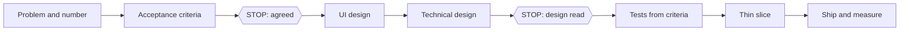

# Feature

- **Use it when:** you add, change or remove something users see or use.
- **Not when:**
  - the behavior stays the same → `/wow-refactor`;
  - something is broken → `/wow-bug`.
- **Reads:** the request, `docs/definition-of-done.md`, the design system, `docs/tracking-plan.md`, past results in `docs/experiments/`.
- **Writes:**
  - the ticket: problem, number, criteria, estimate;
  - tests and code;
  - `docs/tracking-plan.md`;
  - the feature flag.

## First, size it

| Size | Example | Design | Goes through | Feature flag |
|---|---|---|---|---|
| Small | a field, a button, a text | a few lines in the ticket | only this page | no |
| Medium | a new screen or endpoint | a screen sketch and one diagram | `/wow-plan`, `/wow-ui-design`, `/wow-api-design`, `/wow-data-model` | yes |
| Large | payments, sync, anything that touches several parts of the app | a 1–2 page design doc, read by someone before you code | the medium ones, plus `/wow-design-doc` | yes, turned on gradually |

## Steps

1. **Problem and number:** who has the problem, what they do today, and which number shows it worked.
   - Output: 2–3 sentences in the ticket. If no number fits (legal, an internal tool), write why it's still worth doing.
   - Skip it → you build something nobody needed, and you can't tell whether it worked.
2. **Acceptance criteria:** given / when / then, including the error cases. Add one line: "Not in this version: ...".
   - STOP: agree on them with whoever asked for the feature.
   - Skip it → "done" means one thing to you and another to them, and the scope grows while you code.
3. **UI design:** the user's steps and the screen states (empty, loading, error, success).
   - Medium and large → `/wow-ui-design`.
   - Skip it → the happy path works, and users find the other states.
4. **Technical design:** what data changes, the API contract, and what can break (two requests at once, network down, a lot of data).
   - Medium and large → `/wow-api-design`, `/wow-data-model`.
   - It calls a service you don't own → `/wow-integration`; it calls an LLM → `/wow-ai-feature`.
   - STOP (medium and large): someone else reads it before you code. Working alone: ask Claude what's missing.
   - Skip it → you find out the table has the wrong shape after the frontend is built on it.
5. **Tests from the criteria** → `/wow-tdd`: one test per criterion.
   - Logic and API: write the tests first; they start red.
   - A screen you've never built: try it first, then write the tests.
   - Skip it → you test by clicking, and the next change breaks it without anyone noticing.
6. **The thinnest slice end to end:**
   - UI → API → database, happy path only, behind the flag if the size needs one;
   - then the states and the errors;
   - medium and large: the slices from `/wow-plan`.
   - Skip it → the frontend and the backend are each "done" and don't fit together at the end.
7. **Ship and measure** → `/wow-deploy`.
   - With a flag: turn it on for a few users, watch the errors and the number from step 1, then turn it on for everyone and remove the flag.
   - You need proof that the change moved the number → `/wow-experiment`.
   - STOP: look at the number before you turn it on for everyone.
   - Skip it → a bug reaches all users at once, and nobody knows whether the feature helped.

## Removing a feature
1. **Who still uses it:** analytics, logs, API calls.
2. **Tell them**, with a date and an alternative.
3. **Turn it off with the flag**, then watch errors and support tickets.
4. **Remove** the code, the flag, the events in the tracking plan, and the tests.
5. **Remove or archive the data**, following the retention rule. For the tables → `/wow-migration`.

Skip any of these → dead code, data nobody owns, and a surprise for the users who still relied on it.

## Done when
- [ ] every acceptance criterion has a passing test
- [ ] the empty, loading and error states exist
- [ ] the number from step 1 is tracked
- [ ] the flag, if there is one, is removed or has a removal date in the ticket

## Frontend · Backend · Fullstack
The steps are the same for all three. What changes is which steps you own, and which ones you read and agree to. Everyone does steps 1 and 2, together with whoever asked for the feature.
- **Frontend:**
  - you own step 3 and the UI side of steps 5–7;
  - you read and agree to the contract from step 4;
  - you build against the contract with mocked responses (MSW), not invented data;
  - no API change: step 4 shrinks to "which endpoint, and what it returns in each state".
- **Backend:**
  - you own step 4 and the API side of steps 5–7;
  - you read step 3 to know what data each screen needs;
  - every endpoint validates its input and checks that the user is allowed;
  - a migration must work with the version that is still running;
  - no screen (an API for another app): step 3 becomes "who calls it, and what they need from it".
- **Fullstack:**
  - you own all seven steps;
  - the trap is skipping the contract because you write both sides. Write it anyway;
  - generate the TypeScript types from the OpenAPI document, so the two sides can't drift apart.

## Concepts if you get stuck
- Which number to track, and how → F23 The product-minded engineer
- Which states the screen needs → F21 UX for developers
- Loading and error states for server data → F08 Data from the server
- Shaping the endpoint, OpenAPI, generated types → Backend 03 REST API design
- Tables, migrations, transactions → Backend 04 Databases
- Which tests, at which level → F10 Frontend testing · Backend 06 Testing
- Feature flags and rolling out → F16 The frontend in production · Backend 08 Infrastructure, deploy and observability
- Will it hold the traffic? → S00 Numbers and Estimates

## Next level
- Write down what you decided NOT to build, and why. `staff`
- Check who else is affected: other apps or teams that use the same API. `staff`
- Two weeks after release, look at the number again and write the result in the ticket.

## Next
`/wow-pr`, `/wow-deploy`; `/wow-experiment` when you need proof. End with `/wow-retro`.

## Changelog
- 2026-10-05: v1
- 2026-10-05: Frontend · Backend · Fullstack says who owns which step, plus features with no screen or no API change.
- 2026-10-05: v2 — the shared page shape, hand-offs to the design skills, removing a feature.
